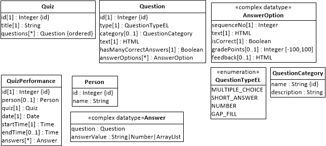

# Online Quiz App
A JS/LocalStorage and CloudFlare Workers KV app for online quizzes

The basic version supports multiple-choice questions only, while the full version also supports short answer questions, numeric answer questions and gap fill questions. 

The questions of a quiz, and the answer options of a multiple-choice question, should always be presented in a random order (shuffled).

The app's default language for text items is EN.

## Use Cases

Possible use cases:

1. A quiz editor manages (creates/updates/deletes) quizzes, assuming that there is a (localStorage or external JSON file) question database.
2. A user takes a quiz: 
    1. user selects a quiz from a list of categorized quizzes 
    2. the quiz questions are presented to the user (all on one page) 
    3. user can enter answers
    4. user submits their answers
    5. the quiz results are presented
2. A quiz editor manages (creates/updates/deletes) quiz questions.
3. A quiz editor manages (updates/deletes) quiz performances

The main use cases are the first two.

## Basic version

The basic version of the app supports multiple-choice questions only.   

<figure><figcaption>The classes of the basic version</figcaption>
 
</figure>

### Model classes

#### Quiz

- questions: a list of question ID numbers like [302754, 308115, ...]

#### Question

- answerOptions: a list of answer options, where
     - sequenceNo: a natural number (1, 2, ...) that identifies the answer option relative to the question to which it belongs.
     - gradePoints (optional): [-100, 100]. Only needed when hasManyCorrectAnswers is true; the correct answer options need to add up to 100, and incorrect answer options may have negative points.

#### QuestionCategory

#### QuizPerformance
- answers: a list of answers, where
     - question: a reference to the question
	 - answerValue: when the question is multiple-choice with hasManyCorrectAnswers being false, then a single natural number denotes the sequenceNo of the chosen answer option;
	   when hasManyCorrectAnswers is true, the answerValue must be a list (array) of sequenceNo.

#### Person
